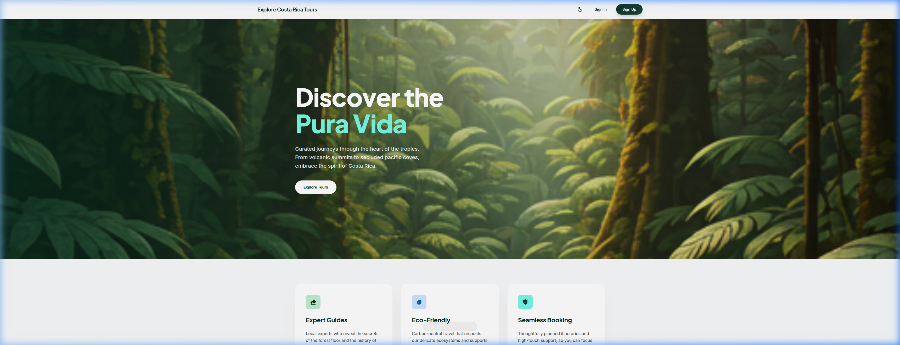
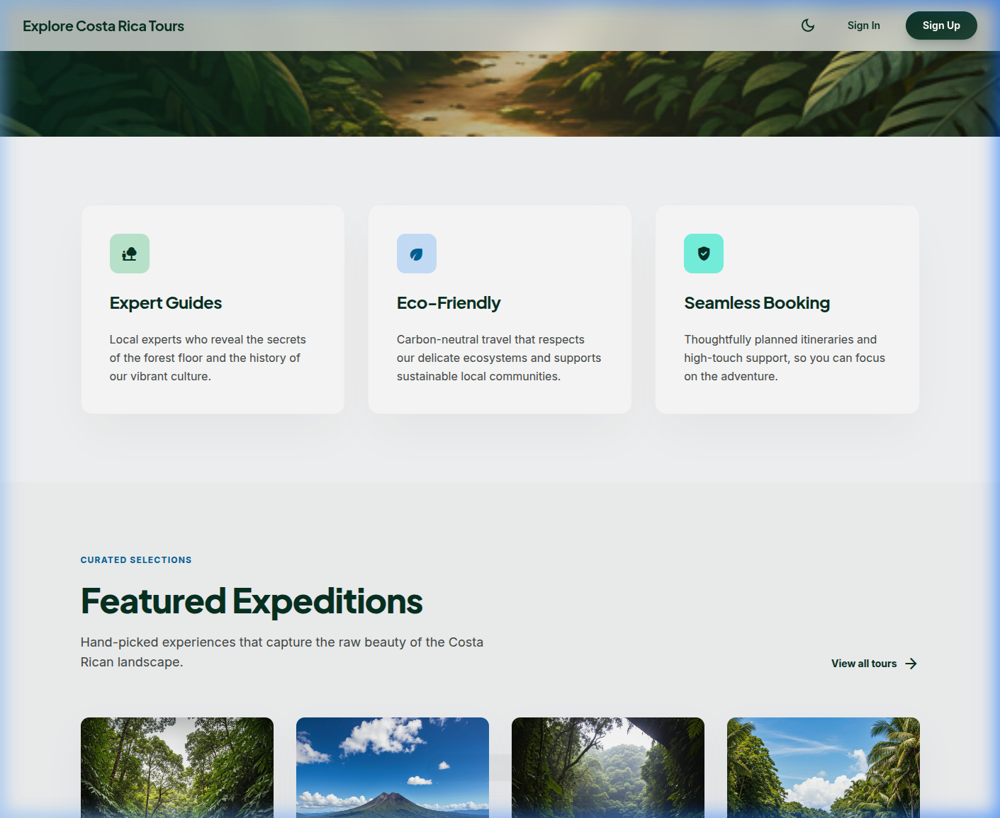
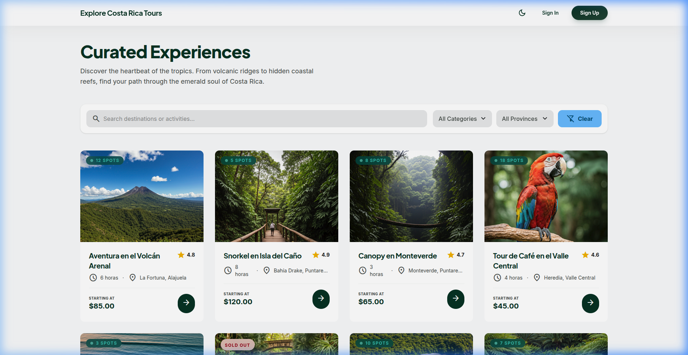
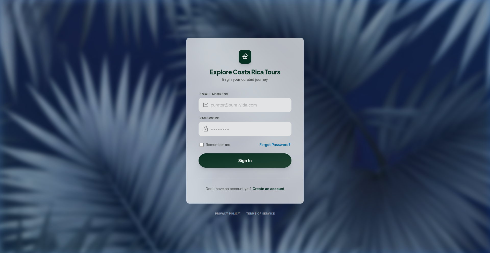
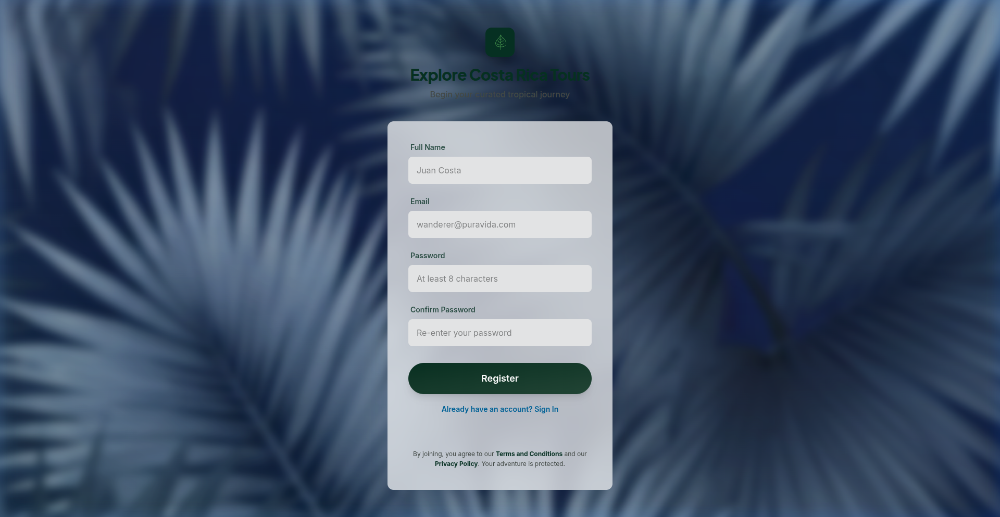
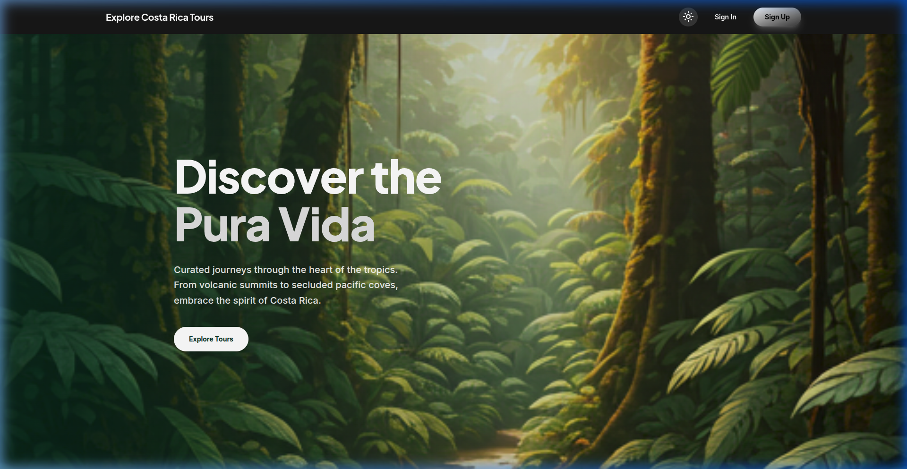

# 🌿 Explore Costa Rica Tours

**Explore Costa Rica Tours** es una aplicación web de reservas de tours turísticos en Costa Rica, desarrollada como proyecto académico para el curso de Desarrollo de Software. La plataforma permite a los usuarios explorar experiencias curadas —desde volcanes hasta arrecifes costeros— con un diseño editorial premium inspirado en la filosofía _"Pura Vida"_.

---

## 📋 Tabla de Contenidos

- [Descripción del Proyecto](#-descripción-del-proyecto)
- [Instrucciones de Despliegue Local](#-instrucciones-de-despliegue-local)
- [Capturas de Pantalla](#-capturas-de-pantalla)
- [Estructura del Repositorio](#-estructura-del-repositorio)
- [Créditos y Herramientas Utilizadas](#-créditos-y-herramientas-utilizadas)

---

## 🏝️ Descripción del Proyecto

Explore Costa Rica Tours es una **Single Page Application (SPA)** que conecta a viajeros con experiencias turísticas auténticas en Costa Rica. El sistema ofrece:

### Funcionalidades Principales

| Módulo | Descripción |
|---|---|
| **Catálogo de Tours** | Listado con búsqueda, filtros por categoría/provincia y paginación |
| **Detalle de Tour** | Vista detallada con galería, itinerario, disponibilidad y precios |
| **Autenticación** | Registro de usuarios, inicio de sesión con JWT y rutas protegidas |
| **Reservaciones** | Gestión de reservas personales para usuarios autenticados |
| **Notificaciones** | Centro de notificaciones para el usuario |
| **Panel de Admin** | Dashboard administrativo con métricas, gestión de tours y usuarios |
| **Modo Oscuro** | Tema claro/oscuro con persistencia y transiciones suaves |

### Arquitectura

La aplicación sigue una arquitectura de **frontend desacoplado** que consume una API REST externa hospedada en Azure API Management. La comunicación se realiza mediante un cliente HTTP centralizado (`apiClient`) con autenticación Bearer Token.

---

## 🚀 Instrucciones de Despliegue Local

### Prerrequisitos

- **Node.js** v20 o superior  
- **npm** v9 o superior  
- Un editor de código (se recomienda VS Code)

### 1. Clonar el repositorio

```bash
git clone https://github.com/<usuario>/explore-costa-rica.git
cd explore-costa-rica
```

### 2. Instalar dependencias

```bash
npm install
```

### 3. Configurar variables de entorno

Crear un archivo `.env` en la raíz del proyecto basado en el archivo de ejemplo:

```bash
cp .env.example .env
```

Editar `.env` con la URL del backend:

```env
VITE_API_BASE_URL=https://your-apim-instance.azure-api.net/api
```

### 4. Iniciar el servidor de desarrollo

```bash
npm run dev
```

La aplicación estará disponible en `http://localhost:5173/`.

### 5. Compilar para producción (opcional)

```bash
npm run build
```

Los archivos compilados se generan en la carpeta `dist/`.

### 6. Previsualizar la build de producción

```bash
npm run preview
```

### Despliegue en la Nube

El proyecto incluye un workflow de **GitHub Actions** (`.github/workflows/`) que realiza CI/CD automático hacia **Azure Static Web Apps** al hacer push a la rama `main`.

---

## 📸 Capturas de Pantalla

### Página de Inicio (Hero)



### Página de Inicio (Características)



### Catálogo de Tours



### Inicio de Sesión



### Registro de Usuario



### Modo Oscuro



---

## 📁 Estructura del Repositorio

```
explore-costa-rica/
├── .env.example                  # Variables de entorno de ejemplo
├── .github/
│   └── workflows/
│       └── azure-static-web-apps-*.yml  # CI/CD a Azure Static Web Apps
├── drw.io/                       # Documentos de diseño UX/UI
│   ├── Analisis_UI_UX_ExploreCR.docx
│   └── WireframeANDprototype.pdf
├── fig/                          # Capturas de pantalla del sistema
├── index.html                    # Punto de entrada HTML
├── package.json                  # Dependencias y scripts del proyecto
├── vite.config.ts                # Configuración de Vite + plugins
├── tsconfig.json                 # Configuración base de TypeScript
├── tsconfig.app.json             # Configuración de TS para la app
├── tsconfig.node.json            # Configuración de TS para Node
├── eslint.config.js              # Reglas de linting
├── public/                       # Activos estáticos (favicon, iconos SVG)
│   ├── favicon.svg
│   └── icons.svg
└── src/
    ├── main.tsx                  # Punto de entrada React
    ├── App.tsx                   # Componente raíz con enrutamiento
    ├── index.css                 # Estilos globales y sistema de diseño
    ├── assets/                   # Imágenes y recursos estáticos
    │   └── hero.png
    ├── components/
    │   ├── layout/               # Componentes de estructura
    │   │   ├── Navbar.tsx        # Barra de navegación principal
    │   │   ├── Footer.tsx        # Pie de página
    │   │   └── AdminSidebar.tsx  # Menú lateral del panel admin
    │   └── shared/               # Componentes reutilizables
    │       └── ProtectedRoute.tsx  # Guardia de rutas autenticadas
    ├── context/
    │   ├── AuthContext.tsx        # Proveedor de estado de autenticación
    │   └── ThemeContext.tsx       # Proveedor de tema claro/oscuro
    ├── hooks/
    │   ├── useTours.ts           # Hook para consulta y filtrado de tours
    │   └── useUsers.ts           # Hook para gestión de usuarios (admin)
    ├── pages/
    │   ├── Home.tsx              # Página de inicio
    │   ├── Login.tsx             # Inicio de sesión
    │   ├── Registration.tsx      # Registro de cuenta
    │   ├── ToursList.tsx         # Catálogo de tours
    │   ├── TourDetail.tsx        # Detalle individual de tour
    │   ├── MyReservations.tsx    # Mis reservaciones
    │   ├── Notifications.tsx     # Centro de notificaciones
    │   ├── AdminDashboard.tsx    # Dashboard administrativo
    │   ├── ManageTours.tsx       # CRUD de tours (admin)
    │   └── ManageUsers.tsx       # CRUD de usuarios (admin)
    ├── services/
    │   ├── apiClient.ts          # Cliente HTTP centralizado (fetch + JWT)
    │   ├── authService.ts        # Servicios de autenticación
    │   ├── toursService.ts       # Servicios de tours
    │   └── usersService.ts       # Servicios de usuarios
    └── types/
        ├── api.ts                # Tipos genéricos de API (errores, respuestas)
        ├── tour.ts               # Interfaz Tour
        ├── user.ts               # Interfaz User, LoginCredentials, RegisterData
        └── reservation.ts        # Interfaz Reservation
```

---

## 🙏 Créditos y Herramientas Utilizadas

### Lenguajes y Runtime

| Herramienta | Versión | Uso |
|---|---|---|
| [TypeScript](https://www.typescriptlang.org/) | ~6.0 | Lenguaje principal con tipado estático |
| [Node.js](https://nodejs.org/) | v20+ | Runtime de JavaScript |

### Framework y Librerías

| Librería | Versión | Uso |
|---|---|---|
| [React](https://react.dev/) | ^19.2 | Biblioteca de UI basada en componentes |
| [React DOM](https://react.dev/) | ^19.2 | Renderizado de React en el navegador |
| [React Router DOM](https://reactrouter.com/) | ^7.14 | Enrutamiento SPA con rutas protegidas |

### Herramientas de Desarrollo

| Herramienta | Versión | Uso |
|---|---|---|
| [Vite](https://vite.dev/) | ^8.0 | Bundler y servidor de desarrollo con HMR |
| [Tailwind CSS](https://tailwindcss.com/) | ^4.2 | Framework de utilidades CSS |
| [@tailwindcss/vite](https://tailwindcss.com/docs/installation/vite) | ^4.2 | Integración de Tailwind con Vite |
| [@vitejs/plugin-react](https://github.com/vitejs/vite-plugin-react) | ^6.0 | Soporte React para Vite (JSX, Fast Refresh) |
| [ESLint](https://eslint.org/) | ^9.39 | Linter para mantener calidad de código |
| [typescript-eslint](https://typescript-eslint.io/) | ^8.58 | Reglas ESLint para TypeScript |

### Tipografías

| Fuente | Proveedor | Uso |
|---|---|---|
| [Plus Jakarta Sans](https://fonts.google.com/specimen/Plus+Jakarta+Sans) | Google Fonts | Titulares y encabezados |
| [Inter](https://fonts.google.com/specimen/Inter) | Google Fonts | Texto de cuerpo y UI |
| [Material Symbols Outlined](https://fonts.google.com/icons) | Google Fonts | Iconografía del sistema |

### Infraestructura y Despliegue

| Servicio | Uso |
|---|---|
| [Azure Static Web Apps](https://azure.microsoft.com/products/app-service/static) | Hosting del frontend en producción |
| [Azure API Management](https://azure.microsoft.com/products/api-management) | Gateway de la API REST consumida |
| [GitHub Actions](https://github.com/features/actions) | CI/CD automático en push a `main` |

### Herramientas de Diseño

| Herramienta | Uso |
|---|---|
| Draw.io / Diagrams.net | Diagramas de arquitectura |
| Figma | Wireframes y prototipos (ver `drw.io/`) |

---

> **Proyecto académico** — Curso de Desarrollo de Software, 2026.
